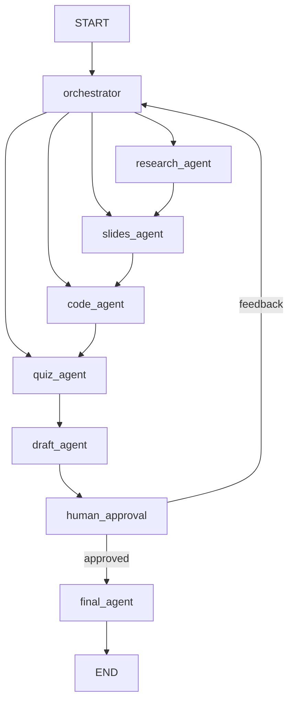

# 🎓 Lecturer Agentic Assistant — دليل البناء خطوة بخطوة

المشروع ده نسخة من فكرة `Travel-Planning-Multi-Agent-System` بس بدل ما بيخطط رحلة، بيجهّز **سيشن كامل** للمحاضر: Presentation + Code + Quiz.

> القاعدة: **متنقليش كود. افهمي الفكرة، اقري الـ docs، اكتبي بإيديكي، وبعدين قارني بالريبو الأصلي.**
> كل Phase ليها: الهدف → الملفات → اللي هتتعلميه → اللي تكتبيه → Checkpoint تتأكدي بيه إنك خلصتي.

---

## 0) الصورة الكبيرة

### المقارنة مع مشروع السفر

| Travel Project | مشروعك | الدور |
|---|---|---|
| `Travel_State.py` | `Session_State.py` | الـ State المشترك |
| route (Select agents) | `orchestrator.py` | يقرر مين يشتغل |
| flight / hotel / weather / budget | `research / slides / code / quiz` agents | المتخصصين |
| `itinerary_agent` | `draft_agent` | يجمّع كل حاجة في Draft |
| `human_approval` | `human_approval` | المحاضر يراجع |
| `final_agent` | `final_agent` | الناتج النهائي |
| AviationStack / OpenWeather / Tavily | Tavily + `pptx_server` + `code_runner_server` | MCP tools |
| Postgres checkpointer | نفسه + **Store للـ long-term** | الميموري |

### شكل الـ Graph



الترتيب الثابت: **research → slides → code → quiz**، وأي agent المحاضر مطلبوش بيتعدّى (زي الريبو الأصلي بالظبط).
ليه research الأول؟ عشان هو اللي بيطلّع الـ outline اللي الباقي بيعتمد عليه.

### الـ Input (زي فورم الرحلة)
`topic`, `course_name`, `student_level` (beginner/intermediate/advanced), `duration_minutes`, `language`, `learning_objectives`, `needs` (مثلاً: slides, code, quiz), `programming_language`, `num_quiz_questions`, `notes`.

---

## Phase 0 — Setup
**الملفات:** `requirements.txt`, `.env.example`, `.gitignore`, `config/settings.py`

**هتتعلمي:** virtual env، `pydantic-settings`، ليه الـ secrets مبتتحطش في الكود.

**اكتبي:**
- في `requirements.txt`: `langgraph`, `langchain`, `langchain-openai` (أو groq), `langchain-mcp-adapters`, `mcp`, `langgraph-checkpoint-postgres`, `psycopg[binary,pool]`, `fastapi`, `uvicorn`, `pydantic-settings`, `python-pptx`, `langsmith`, `python-dotenv`.
- `.env.example`: أسماء بس → `LLM_API_KEY`, `LLM_BASE_URL`, `LLM_MODEL`, `TAVILY_API_KEY`, `DATABASE_URL`, `LANGSMITH_API_KEY`, `LANGSMITH_TRACING`, `LANGSMITH_PROJECT`.
- `Settings(BaseSettings)` class بتقرا من `.env`.

**Checkpoint:** `from config.settings import settings; print(settings.LLM_MODEL)` يشتغل.

---

## Phase 1 — الـ State (قلب المشروع) ⭐
**الملف:** `Session_State.py`

**هتتعلمي:**
- `TypedDict` للـ State.
- **Reducers** (`Annotated[list, add]` أو `add_messages`) — يعني إيه لما أكتر من node يكتب في نفس الـ key.
- إن كل node بيرجّع **dict جزئي** مش الـ state كله.

**اكتبي:**
1. `SessionState(TypedDict)` فيه: الـ inputs، `selected_agents: list[str]`، `outline`، `slides`، `code_examples`، `quiz`، `draft`، `approval_status`، `feedback`، `final_output`، `messages`.
2. `AGENT_ORDER = ["research_agent", "slides_agent", "code_agent", "quiz_agent"]`
3. دالة `next_agent(state, current) -> str`: ترجع الـ agent الجاي من المختارين، أو `"draft_agent"` لو خلصوا. **دي أهم دالة في الـ routing.**

**Checkpoint:** اختبري `next_agent` بإيدك: لو selected = [slides, quiz] والـ current = research → لازم ترجع slides؛ ولو current = slides → quiz؛ ولو quiz → draft_agent.

---

## Phase 2 — LLM + Prompts
**الملفات:** `llm/llm_provider.py`, `prompts.py`

**هتتعلمي:** `ChatOpenAI` مع `base_url` (يشتغل مع Groq/Ollama)، `temperature`، ومعنى **structured output** (`llm.with_structured_output(PydanticModel)`).

**اكتبي:**
- `get_llm(temperature=0.2)` — Factory بترجّع الموديل.
- في `prompts.py` prompt لكل agent. كل prompt لازم يحدد: الدور، الـ input، شكل الـ output، وقواعد (مثلاً: المستوى + المدة).

**نصايح prompts:** الـ quiz agent لازم يرجع JSON بـ schema ثابت، والـ slides agent لازم يحترم المدة (≈ 1–2 دقيقة للسلايد).

**Checkpoint:** استدعي الـ LLM من سكريبت بسيط بـ prompt واحد.

---

## Phase 3 — Agents (واحد واحد، لوحده الأول)
**الملفات:** `graph_nodes/research_agent.py`, `slides_agent.py`, `code_agent.py`, `quiz_agent.py`

**هتتعلمي:** الـ Node = دالة عادية `def node(state) -> dict`. اكتبيها واختبريها **قبل** ما تحطيها في Graph.

| Agent | بيعمل إيه | Output في الـ State |
|---|---|---|
| research | يبحث عن الموضوع ويطلّع outline بأقسام | `outline` |
| slides | لكل قسم: عنوان + bullets + speaker notes | `slides` (list of Pydantic) |
| code | أمثلة كود لكل مفهوم + شرح سطر بسطر | `code_examples` |
| quiz | MCQ بإجابة صح + شرح + مستوى صعوبة | `quiz` |

**اعملي Pydantic models:** `Slide`, `CodeExample`, `QuizQuestion` (ممكن تحطيها في `Session_State.py` أو ملف `schemas`).

**ابدئي بـ quiz_agent** — أبسطهم (مفيش tools)، وبتتعلمي منه structured output.

**Checkpoint:** كل agent تناديه بـ state مصطنع (dict) وترجع dict صح.

---

## Phase 4 — الـ Orchestrator ⭐ (ركّزي هنا)
**الملف:** `graph_nodes/orchestrator.py`

**هتتعلمي:**
- نمط **Orchestrator–Worker**: node واحد "مدير" بيحلل الطلب ويقرر مين يشتغل.
- **Conditional edges** (`add_conditional_edges`) ودالة الـ router.
- Structured output للقرار.

**اكتبي:**
1. `RoutingDecision(BaseModel)`: `selected_agents: list[Literal[...]]`, `reasoning: str`.
2. الـ orchestrator يقرا الـ inputs (+ لاحقاً الـ long-term memory + الـ feedback) ويطلّع القرار → يكتبه في `selected_agents`.
3. **Router function** بتستخدم `next_agent` من Phase 1.

**سؤال تفكري فيه:** إيه الفرق بين إن الـ orchestrator يقرر بالـ LLM وبين `if "quiz" in needs`؟ (الإجابة: المرونة — لو المحاضر كتب في notes "عايز تمارين عملية"، الـ LLM يفهم إنه محتاج code + quiz.) ابدئي بالـ rule-based، وبعدين رقّيها للـ LLM.

**تطوير لاحق (Bonus):** استخدمي `Send` API عشان slides و code و quiz يشتغلوا **parallel** بعد الـ research.

**Checkpoint:** الـ orchestrator يرجّع قرار منطقي لـ 3 inputs مختلفة.

---

## Phase 5 — بناء الـ Graph
**الملفات:** `graph.py`, `graph_nodes/draft_agent.py`

**هتتعلمي:** `StateGraph`, `add_node`, `add_edge`, `add_conditional_edges`, `compile(checkpointer=..., store=...)`.

**اكتبي:**
- `draft_agent`: بيجمّع outline + slides + code + quiz في `draft` واحد منظم.
- `build_graph(checkpointer, store)` ترجّع الـ graph المترجم.

**نصيحة:** من غير DB لسه — استخدمي `InMemorySaver` مؤقتاً.

**Checkpoint:** شغّلي الـ graph من سكريبت لحد `draft_agent` وشوفي الـ State النهائي. وارسمي الـ graph: `graph.get_graph().draw_mermaid()`.

---

## Phase 6 — MCP ⭐
**الملفات:** `MCP_Servers/pptx_server.py`, `code_runner_server.py`, `mcp_client.py`

**هتتعلمي:**
- يعني إيه MCP: بروتوكول قياسي يوصّل الـ LLM بـ tools خارجية.
- Server (يعرّف tools) vs Client (يستهلكها).
- `FastMCP` لعمل server، و `MultiServerMCPClient` للـ client.
- Transports: `stdio` (local) vs `streamable_http`.

**اكتبي:**
1. `pptx_server.py`: tool `create_presentation(title, slides)` بـ `python-pptx` تحفظ `.pptx` في `outputs/`.
2. `code_runner_server.py`: tool `run_python(code)` بـ timeout (⚠️ حطي حدود أمان: timeout، من غير network، ويفضل subprocess معزول). الـ code_agent يستخدمه عشان **يتأكد إن الكود شغال** قبل ما يديه للمحاضر.
3. `mcp_client.py`: ربط Tavily (للـ research) + السيرفرين بتوعك، ودالة `get_tools()`.

**استخدام الـ tools:** إزاي تدّي tools للـ agent (`create_react_agent` أو `llm.bind_tools`)، وإيه الفرق بينهم.

**Checkpoint:** شغّلي كل MCP server لوحده، وناديه من الـ client بسكريبت، قبل ما تربطيه بالـ agents.

---

## Phase 7 — Short-Term Memory ⭐
**الملفات:** `db/checkpointer.py`, `docker-compose.yml`

**هتتعلمي:**
- **Short-term memory = Checkpointer**: بيحفظ الـ State بعد كل step، مربوط بـ `thread_id`.
- بيدّيك: استمرار المحادثة، الـ Human-in-the-loop، الـ time travel، والتعافي من الأخطاء.
- ليه Postgres بدل InMemory (الـ persistence بعد restart).

**اكتبي:**
- `docker-compose.yml` بـ service لـ postgres.
- `get_checkpointer()` بـ `AsyncPostgresSaver` (أو `PostgresSaver`) + `.setup()` أول مرة.
- مرري `config = {"configurable": {"thread_id": session_id}}` في كل `invoke`.

**Checkpoint:** شغّلي الـ graph، اقفلي البرنامج، افتحيه تاني، وناديه بنفس `thread_id` → `graph.get_state(config)` لازم يرجّع الـ state القديم.

---

## Phase 8 — Human-in-the-Loop
**الملف:** `graph_nodes/human_approval.py`, `final_agent.py`

**هتتعلمي:** `interrupt()` و `Command(resume=...)`. ليه الـ interrupt محتاج checkpointer.

**اكتبي:**
- `human_approval`: بيعمل `interrupt({"draft": state["draft"]})` وبيستنى قرار: `approve` أو `revise + feedback`.
- لو `revise`: يرجع للـ orchestrator ومعاه الـ feedback (loop!). حطي **حد أقصى** للمحاولات (مثلاً 3) عشان متدخليش infinite loop.
- `final_agent`: يعمل الـ `.pptx` عن طريق MCP + يحفظ ملف الكود + الـ quiz JSON.

**Checkpoint:** run → يقف عند الـ approval → `Command(resume="approve")` → يكمّل.

---

## Phase 9 — Long-Term Memory ⭐
**الملف:** `db/long_term_store.py` (+ تعديل `orchestrator.py` و `final_agent.py`)

**هتتعلمي:**
- الفرق الجوهري: **short-term** = جوه thread واحد (سيشن واحد)، **long-term** = بين كل الـ threads (بين السيشنز المختلفة).
- LangGraph **Store**: `put / get / search` بـ **namespace** زي `("lecturer", lecturer_id, "preferences")`.
- أنواع الميموري: Semantic (حقائق/تفضيلات)، Episodic (سيشنز قديمة)، Procedural (قواعد/تعليمات).

**اكتبي (أمثلة لحاجات تتحفظ):**
- تفضيلات المحاضر: لغة الشرح، ستايل السلايدات، لغة البرمجة المفضلة.
- ملخص السيشنز اللي فاتت (عشان السيشن الجديد يكمّل عليها ومتكررش).
- الـ feedback المتكرر ("قلل النص في السلايدات").

**الربط:**
1. `AsyncPostgresStore` + `compile(checkpointer=..., store=...)`.
2. في `orchestrator`: اقري الـ memory (`store.asearch(namespace)`) وحطيها في الـ prompt.
3. في `final_agent` (بعد الموافقة): خزّني ملخص السيشن + أي feedback.

**Checkpoint:** سيشن 1 بـ `thread_id=A` تقولي فيه تفضيل → سيشن 2 بـ `thread_id=B` (thread مختلف) لازم الـ orchestrator يعرف التفضيل.

---

## Phase 10 — LangSmith ⭐
**الملفات:** `config/tracing.py`, `evals/dataset.json`, `evals/run_eval.py`

**هتتعلمي:**
- **Tracing**: شوفي كل node، كل LLM call، كل tool call، الـ tokens والـ latency.
- LangGraph بيتتبع تلقائي لما تفعّلي env vars.
- `tags` و `metadata` في الـ config عشان تفلتري (مثلاً `lecturer_id`).
- `@traceable` لأي دالة عادية.
- **Datasets + Evaluators**: تقييم الجودة بشكل منهجي.

**اكتبي:**
1. فعّلي: `LANGSMITH_TRACING=true`, `LANGSMITH_API_KEY`, `LANGSMITH_PROJECT`.
2. مرري `metadata={"session_id": ...}` في الـ config.
3. اعملي dataset من 5–10 inputs (موضوعات مختلفة).
4. Evaluators بسيطة:
   - عدد السلايدات منطقي بالنسبة للمدة؟
   - الـ quiz JSON valid؟
   - الكود اتنفّذ من غير errors؟
   - (متقدم) LLM-as-judge: هل المحتوى مناسب للمستوى؟

**Checkpoint:** افتحي الـ trace في LangSmith وحددي أبطأ node وأكتر node بيستهلك tokens.

---

## Phase 11 — API + UI
**الملفات:** `main.py`, `app/app.py`, `routes/session_routes.py`, `GraphController.py`, `ui/*`

**هتتعلمي:** FastAPI + `lifespan` (تفتحي الـ DB connections مرة واحدة وتقفليها), Pydantic request models, ازاي تفصلي الـ API عن منطق الـ graph.

**اكتبي:**
- `GraphController`: كلاس فيه `start(request) -> session_id + draft`, `approve(session_id, decision)`, `get_state(session_id)`.
- Endpoints:
  - `POST /api/session` → يشغّل لحد الـ approval
  - `POST /api/session/approve` → يكمّل
  - (Bonus) `GET /api/session/{id}/download`
- UI: فورم بسيط + عرض الـ draft + زرار Approve/Revise.

---

## Phase 12 — Docker + README
**الملفات:** `Dockerfile`, `docker-compose.yml`, `README.md`

- Dockerfile للـ app، وcompose بيشغّل app + postgres.
- README: الفكرة، الـ graph (mermaid)، الـ setup، أمثلة curl، والـ limitations.

---

## ✅ ترتيب الشغل المختصر

```
0 Setup → 1 State → 2 LLM/Prompts → 3 Agents (لوحدهم) → 4 Orchestrator
→ 5 Graph → 6 MCP → 7 Short-term → 8 HITL → 9 Long-term
→ 10 LangSmith → 11 API/UI → 12 Docker
```

## 🧪 قاعدة ذهبية
بعد كل Phase اعملي commit، وشغّلي اللي عملتيه **قبل** ما تروحي للي بعده.

## 📚 مراجع
- LangGraph docs: Persistence, Memory, Human-in-the-loop, Workflows & Agents
- MCP docs + `langchain-mcp-adapters`
- LangSmith docs: Tracing, Evaluation
