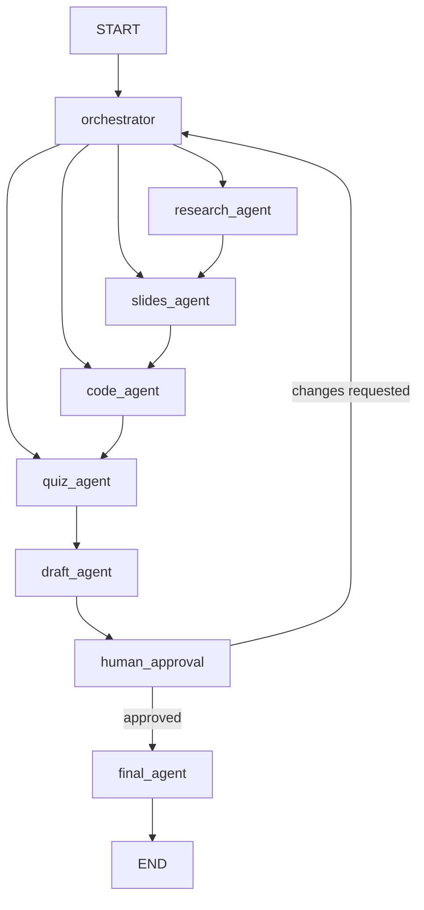

# Lecturer Agentic Assistant

A multi-agent assistant that helps lecturers prepare a full teaching session: **slides, code examples, and a quiz**. It is built around a multi-agent workflow orchestrated with **LangGraph**. An orchestrator reads the lecturer's brief, decides which specialist agents are needed, and the draft pauses for the lecturer's review before any final files are produced.

---

## Live demo

<!-- TODO: replace the link below with your deployed URL when the project is done. -->

**Try it here: [https://YOUR-LIVE-LINK-HERE](https://YOUR-LIVE-LINK-HERE)**

> The link above is a placeholder. Until it is replaced, follow [Setup](#setup) to run the project locally.

<!-- TODO: add a screenshot at docs/ui-preview.png -->


---

## What it does

Given a session brief (topic, course, student level, duration, language, objectives, and what to prepare), the system:

1. **Plans**: the orchestrator decides which agents to run, using the brief and what it remembers about the lecturer.
2. **Researches** the topic and builds a shared outline.
3. **Generates** slides, code examples (checked by actually running them), and quiz questions.
4. **Compiles** everything into one draft.
5. **Pauses** for the lecturer to approve or request changes.
6. **Produces** the final `.pptx`, code file, and quiz file.

## How it works



Agents run in a fixed order (research, slides, code, quiz). Any agent the orchestrator did not select is skipped, and the graph routes straight to the next selected agent, or to `draft_agent` once all selected agents have run.

### Agents

| Agent | Responsibility |
| --- | --- |
| `orchestrator` | Reads the brief, memory, and any feedback, then selects which agents run |
| `research_agent` | Searches the web and produces the session outline |
| `slides_agent` | Writes slide titles, bullets, and speaker notes for each outline section |
| `code_agent` | Writes code examples and verifies them by running them |
| `quiz_agent` | Produces multiple-choice questions with answers and explanations |
| `draft_agent` | Combines all outputs into a single draft package |
| `human_approval` | Pauses the graph so the lecturer can approve or request changes |
| `final_agent` | Creates the final files and saves what was learned to long-term memory |

## Memory

| Type | Scope | Implementation | Used for |
| --- | --- | --- | --- |
| **Short-term** | One session (`thread_id`) | LangGraph checkpointer on PostgreSQL | Resuming a session, human-in-the-loop pause, recovery after restart |
| **Long-term** | All sessions of a lecturer | LangGraph Store on PostgreSQL | Preferences (slide style, language), summaries of past sessions, recurring feedback |

Long-term memory is organized by namespace, for example `("lecturer", <lecturer_id>, "preferences")`. The orchestrator reads it before planning, and `final_agent` writes to it after approval.

## Observability and evaluation

Tracing and evaluation use **LangSmith**.

- Every node, LLM call, and tool call is traced, with latency and token usage.
- Runs are tagged with session and lecturer metadata so they can be filtered.
- `evals/` contains a dataset of sample briefs and evaluators that check, for example, that the number of slides fits the duration, the quiz JSON is valid, and the code examples run without errors.

## Tech stack

**Backend**

- [FastAPI](https://fastapi.tiangolo.com/): HTTP API layer
- [LangGraph](https://langchain-ai.github.io/langgraph/): multi-agent orchestration, checkpointing, store
- PostgreSQL: short-term and long-term memory
- MCP (Model Context Protocol): tool integration layer
- [LangSmith](https://smith.langchain.com/): tracing and evaluation
- [python-pptx](https://python-pptx.readthedocs.io/): PowerPoint generation
- LLM providers: **Groq** and **Google Gemini** (switchable with one environment variable)

**Tools (via MCP)**

| Server | Type | Purpose |
| --- | --- | --- |
| Tavily | External | Web search for research |
| `pptx_server` | Custom, runs locally | Creates the `.pptx` file |
| `code_runner_server` | Custom, runs locally | Runs code examples with a timeout to verify them |

**Frontend**

- Plain HTML, CSS, and JavaScript in `ui/`: a session brief form, progress strip, tabbed draft review, and approve or request-changes controls.

## API

| Endpoint | Purpose |
| --- | --- |
| `POST /api/session` | Submit a session brief and run the graph up to the human-approval checkpoint |
| `POST /api/session/approve` | Approve the draft, or request changes with feedback, and resume the graph |

Example request:

```bash
curl -X POST http://localhost:8000/api/session \
  -H "Content-Type: application/json" \
  -d '{
        "lecturer_id": "dr-sara",
        "topic": "Python decorators",
        "course_name": "Advanced Python",
        "student_level": "intermediate",
        "duration_minutes": 90,
        "language": "English",
        "programming_language": "Python",
        "needs": ["slides", "code", "quiz"],
        "num_quiz_questions": 8,
        "learning_objectives": "Students can write their own decorators.",
        "notes": "Keep slides short."
      }'
```

## Human-in-the-loop

After `draft_agent` produces a draft, the graph pauses at `human_approval` instead of finalizing. The lecturer can:

- **Approve**: call `POST /api/session/approve` with `"decision": "approve"` and the `session_id`. `final_agent` then creates the files.
- **Request changes**: call the same endpoint with `"decision": "revise"` and a `feedback` message. The graph returns to the orchestrator with that feedback, up to a limited number of attempts.

## Project structure

```
.
├── graph_nodes/            # Agents: orchestrator, research, slides, code, quiz, draft, human_approval, final
├── MCP_Servers/            # Custom MCP servers (pptx, code runner) and the MCP client
├── Session_State.py        # Shared graph state, agent order, agent-selection logic
├── graph.py                # Graph construction and compilation
├── GraphController.py      # Wraps the graph: start, approve, get state
├── prompts.py              # System prompts for every agent
├── main.py                 # Application entrypoint
├── app/                    # FastAPI app setup
├── routes/                 # API routes
├── config/                 # Settings (pydantic-settings) and LangSmith tracing setup
├── db/                     # Checkpointer (short-term) and Store (long-term)
├── llm/                    # LLM provider factory (Groq / Gemini)
├── templates/              # PowerPoint template and output templates
├── ui/                     # Frontend (index.html, style.css, script.js)
├── evals/                  # LangSmith dataset and evaluators
├── outputs/                # Generated files
├── docker-compose.yml      # PostgreSQL service
├── Dockerfile
├── pyproject.toml
└── .env.example
```

## Setup

### Prerequisites

- Python 3.12+
- [uv](https://docs.astral.sh/uv/)
- Docker (for PostgreSQL)
- API keys:
  - [Groq](https://console.groq.com/) and/or [Google AI Studio](https://aistudio.google.com/) (Gemini)
  - [Tavily](https://tavily.com/)
  - [LangSmith](https://smith.langchain.com/) (optional, for tracing)

### Installation

```bash
git clone https://github.com/YOUR-USERNAME/lecturer-agentic-assistant.git
cd lecturer-agentic-assistant

uv sync
```

### Configuration

Copy the example file and fill in your values:

```bash
cp .env.example .env
```

| Variable | Description |
| --- | --- |
| `LLM_PROVIDER` | `groq` or `gemini` |
| `GROQ_API_KEY` | Groq API key |
| `GROQ_MODEL` | Groq model name |
| `GOOGLE_API_KEY` | Gemini API key |
| `GEMINI_MODEL` | Gemini model name |
| `TAVILY_API_KEY` | Tavily API key |
| `DATABASE_URL` | PostgreSQL connection string |
| `LANGSMITH_TRACING` | `true` to enable tracing |
| `LANGSMITH_API_KEY` | LangSmith API key |
| `LANGSMITH_PROJECT` | LangSmith project name |

Model names change over time. Check each provider's current model list before filling in `GROQ_MODEL` and `GEMINI_MODEL`.

### Running

1. Start the database:

   ```bash
   docker compose up -d
   ```

2. In another terminal, start the app:

   ```bash
   uv run python main.py
   ```

3. Open [http://localhost:8000](http://localhost:8000).

### Running the evaluations

```bash
uv run python evals/run_eval.py
```

Results appear in your LangSmith project.

## Known limitations

- **Free-tier rate limits**: Groq, Gemini, and Tavily free tiers limit requests per minute and per month. A full session makes several LLM calls, so heavy testing can hit these limits.
- **Text-only slides**: slides contain titles, bullets, and speaker notes. Images and diagrams are not generated.
- **Code verification**: `code_runner_server` runs code with a timeout. It is meant for local development and should be sandboxed further before any public deployment.
- **Model quality**: smaller or local models may produce malformed structured output. The agents retry, but results vary by model.

## Roadmap

- [ ] Run slides, code, and quiz agents in parallel
- [ ] Export the quiz to common LMS formats
- [ ] Add images and diagrams to slides
- [ ] Support uploading existing course material as context

## License

Apache-2.0. See [LICENSE](LICENSE).
